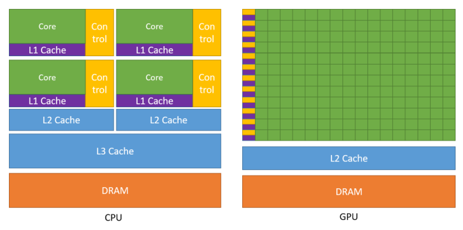
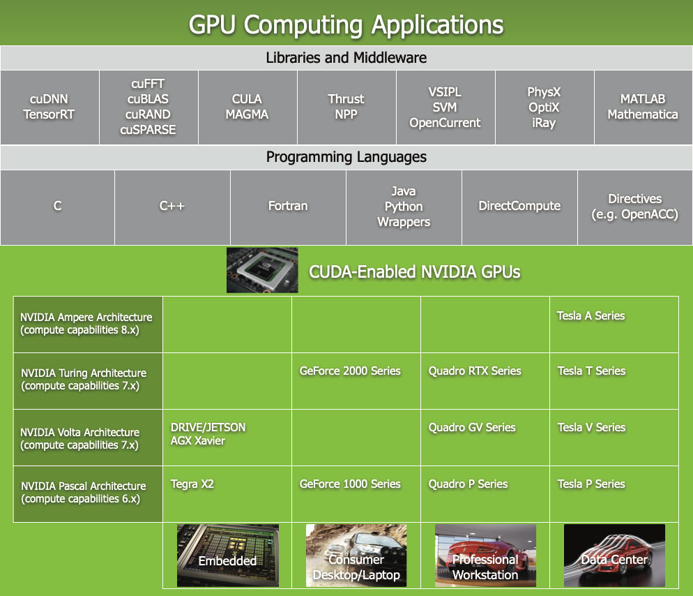
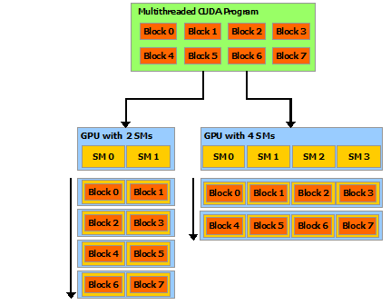
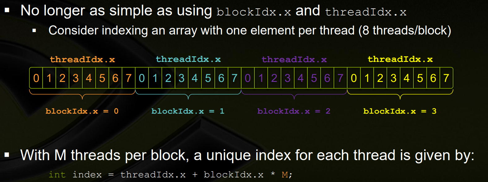
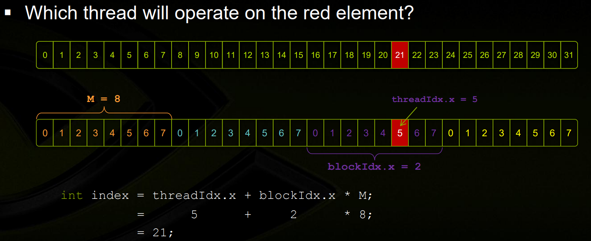
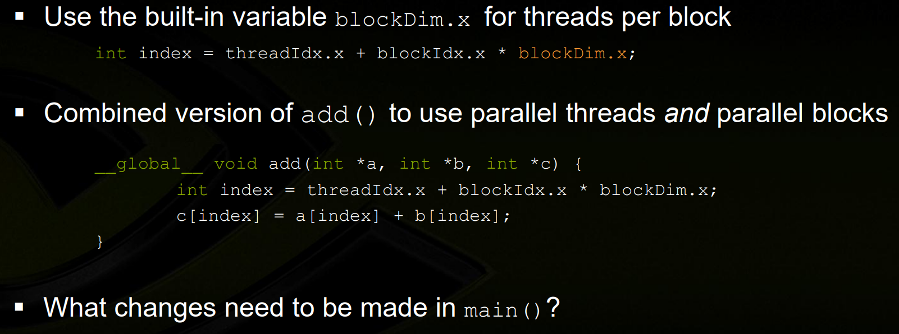

## Helpful Links

[Nvidia GPUDirect Overview](https://developer.nvidia.com/gpudirect)

[Nvidia System Management Interface](https://developer.nvidia.com/nvidia-system-management-interface)

[GPUDirect RDMA Access Example Code](https://github.com/karakozov/gpudma)

[Mellanox GPUDirect RDMA Example](https://github.com/Mellanox/gpu_direct_rdma_access)

[NVIDIA CUDA Basics](images/sc11-cuda-c-basics.pdf)

[GPUDirect Benchmark Tests](https://www.mellanox.com/related-docs/prod_software/Mellanox_GPUDirect_User_Manual_v1.5.pdf)

[RDMA Aware Programming User Manual (has a great RDMA architecture overview)](images/RDMA_Aware_Programming_user_manual.pdf)
**NOTE** This also includes how Infiniband works.

[Packet Capture with GPUDirect](images/s9730-packet-processing-on-gpu-at-100gbe-line-rate.pdf)

[How Infiniband Works](https://blog.zhaw.ch/icclab/infiniband-an-introduction-simple-ib-verbs-program-with-rdma-write/)

## Using Nvidia SMI

Run from Windows: `c:\Windows\System32\DriverStore\FileRepository\nvdm.inf_amd64_3349a8117b680632>nvidia-smi.exe`

**OUTPUT**

```
c:\Windows\System32\DriverStore\FileRepository\nvdm.inf_amd64_3349a8117b680632>nvidia-smi.exe
Wed Nov 10 15:47:38 2021
+-----------------------------------------------------------------------------+
| NVIDIA-SMI 471.35       Driver Version: 471.35       CUDA Version: 11.4     |
|-------------------------------+----------------------+----------------------+
| GPU  Name            TCC/WDDM | Bus-Id        Disp.A | Volatile Uncorr. ECC |
| Fan  Temp  Perf  Pwr:Usage/Cap|         Memory-Usage | GPU-Util  Compute M. |
|                               |                      |               MIG M. |
|===============================+======================+======================|
|   0  Quadro T1000       WDDM  | 00000000:01:00.0 Off |                  N/A |
| N/A   52C    P8     2W /  N/A |    287MiB /  4096MiB |      0%      Default |
|                               |                      |                  N/A |
+-------------------------------+----------------------+----------------------+

+-----------------------------------------------------------------------------+
| Processes:                                                                  |
|  GPU   GI   CI        PID   Type   Process name                  GPU Memory |
|        ID   ID                                                   Usage      |
|=============================================================================|
|    0   N/A  N/A      3360    C+G   ...ser\Application\brave.exe    N/A      |
+-----------------------------------------------------------------------------+
```

Processes is a list of processes having compute or graphics context on the device. Compute processes are reported on all the fully supported products. Reporting for Graphics processes is limited to the supported products starting with Kepler architecture. Each Entry is of format `<GPU Index> <PID> <Type> <Process Name> <GPUMemory Usage>"`

- GPU Index - Represents NVML index of the device?
- PID Represents process ID corresponding to the active compute or graphics context?
- Type - Displayed as "C" for compute process, "G" for graphics process, and "C+G" for the procses having both compute and graphics contexts
- Process Name - Represents process name for the compute or graphics process
- GPU Memory Usage - Amount of memory used on the device by the context. Not available on Windows when running in WDDM mode because Windows KMD manages all memory not Nvidia driver

## Notes on CUDA Programming

See 

### Overview





At its core CUDA has three key abstractions:
- a hierarchy of thread groups
- shared memories
- [barrier synchronization](https://docs.microsoft.com/en-us/windows/win32/sync/synchronization-barriers) 

This decomposition preserves language expressivity by allowing threads to cooperate when solving each sub-problem, and at the same time enables automatic scalability. Indeed, each block of threads can be scheduled on any of the available multiprocessors within a GPU, in any order, concurrently or sequentially, so that a compiled CUDA program can execute on any number of multiprocessors as illustrated by Figure 3, and only the runtime system needs to know the physical multiprocessor count.



**Note**: A GPU is built around an array of Streaming Multiprocessors (SMs) (see [Hardware Implementation](https://docs.nvidia.com/cuda/cuda-c-programming-guide/index.html#hardware-implementation) for more details). A multithreaded program is partitioned into blocks of threads that execute independently from each other, so that a GPU with more multiprocessors will automatically execute the program in less time than a GPU with fewer multiprocessors.

### Kernels

CUDA C++ extends C++ by allowing the programmer to define C++ functions, called kernels, that, when called, are executed N times in parallel by N different CUDA threads, as opposed to only once like regular C++ functions.

The following sample code, using the built-in variable threadIdx, adds two vectors A and B of size N and stores the result into vector C.

```c
// Kernel definition
__global__ void VecAdd(float* A, float* B, float* C)
{
    int i = threadIdx.x;
    C[i] = A[i] + B[i];
}

int main()
{
    ...
    // Kernel invocation with N threads
    VecAdd<<<1, N>>>(A, B, C);
    ...
}
```

### Global Keyword

The __global__ keyword indicates a function that runs on the device and is called from host code

### How nvcc separates code

nvcc separates source code into host and device components. Device functions (e.g. mykernel()) are proccesed by the Nvidia compiler while host functions (e.g. main()) are processed by standard host compiler (gcc, cl, etc)

### Thread Hierarchy

For convenience, threadIdx is a 3-component vector, so that threads can be identified using a one-dimensional, two-dimensional, or three-dimensional thread index, forming a one-dimensional, two-dimensional, or three-dimensional block of threads, called a thread block. This provides a natural way to invoke computation across the elements in a domain such as a vector, matrix, or volume.

## CUDA Runtime

The runtime is introduced in CUDA Runtime. It provides C and C++ functions that execute on the host to allocate and deallocate device memory, transfer data between host memory and device memory, manage systems with multiple devices, etc. A complete description of the runtime can be found in the CUDA reference manual.

The runtime is built on top of a lower-level C API, the CUDA driver API, which is also accessible by the application. The driver API provides an additional level of control by exposing lower-level concepts such as CUDA contexts - the analogue of host processes for the device - and CUDA modules - the analogue of dynamically loaded libraries for the device. Most applications do not use the driver API as they do not need this additional level of control and when using the runtime, context and module management are implicit, resulting in more concise code. As the runtime is interoperable with the driver API, most applications that need some driver API features can default to use the runtime API and only use the driver API where needed. The driver API is introduced in Driver API and fully described in the reference manual.

The runtime is implemented in the cudart library, which is linked to the application, either statically via cudart.lib or libcudart.a, or dynamically via cudart.dll or libcudart.so. Applications that require cudart.dll and/or cudart.so for dynamic linking typically include them as part of the application installation package. It is only safe to pass the address of CUDA runtime symbols between components that link to the same instance of the CUDA runtime.

## Questions

- What is NVML Index?
- What is WDDM mode?
- What is Windows KMD?

## What is a Graphics Context?

See https://stackoverflow.com/a/23087951/4427375

A GPU context is described [here](http://docs.nvidia.com/cuda/cuda-c-programming-guide/index.html#context). It represents all the state (data, variables, conditions, etc.) that are collectively required and instantiated to perform certain tasks (e.g. CUDA compute, graphics, H.264 encode, etc). A CUDA context is instantiated to perform CUDA compute activities on the GPU, either implicitly by the CUDA runtime API, or explicitly by the CUDA device API.

## What is a PCIe Root Complex?

https://www.quora.com/What-is-a-PCIe-root-complex?share=1

## How does PCIe Enumeration Work?

https://www.quora.com/What-is-PCIE-enumeration/answer/Satish-Kumar-525?ch=15&oid=31389493&share=44585235&target_type=answer

## NVMe over PCIe vs Other Protocols

https://www.quora.com/Is-NVMe-faster-than-PCIe/answer/Mike-Jones-169?ch=15&oid=193548046&share=a587ff45&target_type=answer

## What is a PCIe Function?

https://www.quora.com/What-is-a-PCIe-function/answer/Udit-Khanna-2?ch=15&oid=58319695&share=c7f066e5&target_type=answer

## PCIe-Bus and NUMA Node Correlation

https://social.msdn.microsoft.com/Forums/en-US/fabb05b7-eb3f-4a7c-91c5-1ced90af3d0c/pciebus-and-numanode-correlation

## How does the root complex work?

https://codywu2010.wordpress.com/2015/11/29/how-modern-multi-processor-multi-root-complex-system-assigns-pci-bus-number/

## What is PCIe P2P?

https://xilinx.github.io/XRT/master/html/p2p.html

## What is the difference between a thread and a block?

https://stackoverflow.com/questions/16635587/whats-the-difference-between-a-thread-in-a-block-and-a-warp32-threads

A block is used to run things in parallel and for each block there is one thread. Each parallel invocation of a kernel is a block and a set of blocks is a grid.

You can also run multiple threads per block.




# GPUDirect RDMA example.

## Install
1 Clone repo and get source code of NVIDIA-Linux-x86_64-X.Y driver 
the same version as installed in your systems.

2 Extract it in the gpudma project directory and create symbolic link "nvidia" on NVIDIA-Linux-x86_64-X.Y driver directory.
Default location is ~/gpudma; For another location you must set variable GPUDMA_DIR, for example: GPUDMA_DIR=/xprj/gpudma

3 Build NVIDIA driver in nvidia/kernel. We need only Module.symvers file from nvidia/kernel directory.

4 Build gpumem module.

5 Build application app

6 Build application app_template

**Linux commands:**

git clone https://github.com/karakozov/gpudma.git

cp ~/Downloads/NVIDIA-Linux-x86_64-367.57.run ~/gpudma

./NVIDIA-Linux-x86_64-367.57.run -x

ln -svf NVIDIA-Linux-x86_64-367.57 nvidia

cd ~/gpudma/nvidia/kernel && make

cd ~/gpudma/module && make

cd ~/gpudma/app && make

## Load driver

cd ~/gpudma/module && ./drvload.sh

Check driver: ls -l /dev/gpumem

crw-rw-rw-. 1 root root 10, 55 Apr  2 21:57 /dev/gpumem

## Run app example

cd ~/gpudma/app && ./gpu_direct

Application create CUDA context and allocate GPU memory.
This memory pointer passed to gpumem module. Gpumem module get address of all physical 
pages of the allocates area and GPU page size. Application can get addresses and do mmap(), 
fill data pattern and free all of them. Than release GPU memory allocation and unlock pages.

Test must be finished with message: "Test successful"

## Build and run app_template

app_template must be built with Nsight Eclipse Edition from NVIDIA.

Command line for launch:  **app_template** **-count** ncount **-size** nsize
* ncount - block counts for read, 0 - for infinity cycle; Default is 16;
* nsize  - size of one buffers in kbytes. Maximum size is 65536. Default is 256;

Main mode is infinity cycle (ncount=0). There are two command for launch application:
* run_cycle_1M - launch with buffers of 1 megabytes
* run_cycle_64M - launch with buffers of 64 megabytes

Infinity cycle must be executed only from console. Nsight Eclipse Edition cannot correct display status line with "\r" symbol. If you can do it then send me about it, please.
For launch application from Nsight Eclipse Edition use non-zero value for count argument. This is enough for debugging.

There are main executing stages:

1. Create exemplar TF_TestCnt - launch thread for working with CUDA

2. Prepare
  * Open device
  * Allocate three buffers with size <nsize> and map in the BAR1 - class CL_Cuda
  * Allocate 64 kbytes buffer for struct TaskMonitor
  * Allocate page-locked HOST memory for td->hostBuffer 
  * Allocate page-locked HOST memory for struct TaskHostMonitor

3. Launch main cycle - TF_TestCnt::Run()
  * Launch thread for filling buffers - TF_TestCnt::FillThreadStart()
  * Launch kernel for checking data - run_checkCounter()
  * Check flag in the host memory and start DMA transfer - cudaMemcpyAsync()
  * Check data: TestCnt::CheckHostData()
  * Measuring velosity of data transfer

4. Periodcal launch function TF_TestCnt::StepTable() from function main() for display status information. It is working only for infinity cycle mode. Function display several parameters:
  * CUDA_RD - number of received buffers to CUDA
  * CUDA_OK - number of correct buffers to CUDA
  * CUDA_ERR - number of incorrect buffers to CUDA
  * HOST_RD - number of received buffers to HOST
  * HOST_OK - number of correct buffers to HOST
  * HOST_ERR - number of incorrect buffers to HOST
  * E2C_CUR - current velosity of data transfer from external device to CUDA
  * E2C_AVR - avarage velosity of data transfer from external device to CUDA
  * C2H_CUR - current velosity of data transfer from CUDA to HOST
  * C2H_AVR - avarage velosity of data transfer from CUDA to HOST

5. Function run_checkCounter() launch wrap of 32 thread for checking data. 

  Thread 0 is difference from another:
   * Read ts->irqFlag in the global memory and write it in the local wrap memory.
   * Write checking data to output buffers

  Thread 0 and another threads :
   * Check flag ptrMonitor->flagExit and exit if it is set.
   * Check received data  
   * Write first 16 errors to struct "check"

6. Display result after exiting from main cycle - TF_TestCnt::GetResult()

7. Free memory

Some notes:
* app_template/create_doc.sh - create documentation via doxygen
* There is class CL_Cuda_private for internal data for CL_Cuda
* There is file task_data.h with structs:
  * TaskData - internal task for TF_TestCnt
  * TaskMonitor - struct for shared memory in the CUDA 
  * TaskHostMonitor - struct for shared memory in the HOST
  * TaskBufferStatus - struct for work with one buffer
  * TaskCheckData - struct for error data
  * const int TaskCounts=32 - number of threads in the wrap


